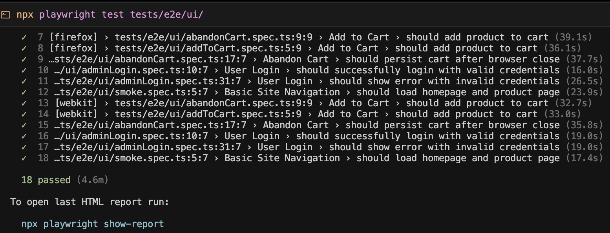
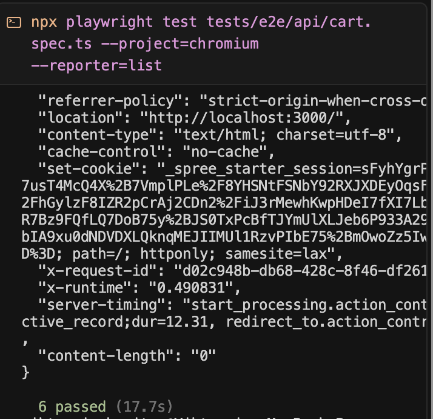

# Spree eCommerce Quality Engineering Assessment

As a Senior Software Test Engineer, I approached this assignment not just as a checklist of tasks, but as a real-world scenario where my goal was to build a maintainable, scalable, and effective test framework for a production-grade eCommerce application.

This README outlines the technical implementation, decision-making process, key test scenarios, challenges I encountered, and the strategy I followed to prioritize high-risk areas for automation.

---

## My Approach

I began by thoroughly reviewing the Spree Commerce platform, api documentation and the requirements provided. My goal was to simulate what it would be like to onboard a new product and design a test strategy that would work beyond a simple demo.

I broke down the work into the following stages:

1. **Framework Planning** – Decided on the folder structure, test layering, and reusable utility design using Playwright with TypeScript.
2. **Environment Setup** – Installed required system dependencies (like libvips), ensured local test stability, and prepared the groundwork for CI integration.
3. **Automation Development** – Focused on high-priority test flows, starting with both API and UI automation.
4. **Debugging and Optimization** – Resolved flaky behaviors, addressed performance bottlenecks, and fine-tuned selectors and sessions.
5. **CI Integration** – Configured GitHub Actions to ensure clean runs and report collection after every commit.

---

## Visual Results

### UI Test Execution Summary

### API Test Summary

### HTML Report Preview
[View HTML Test Report (PDF)](tests/test-results/artifacts/screencapture-localhost-9323-2025-04-10-15_37_33.pdf)

---

## Challenges and How I Solved Them

### 1. Authentication and Session Persistence
I initially struggled with user sessions not persisting between API calls. I created a reusable session manager, wrapped authentication in helper functions, and validated session expiration explicitly.

### 2. libvips Installation for Image Processing
Tests failed due to missing image processing dependencies. I identified the missing `libvips` library, installed it, and added fallback logic while also updating documentation for future developers.

### 3. Performance Bottlenecks in Database Queries
Some scenarios were extremely slow because of unnecessary product joins. I used SQL logging to identify the issue, applied test-level isolation, and refactored how test data was created.

### 4. Flaky UI Tests
Dynamic content caused selectors to fail randomly. I resolved this by replacing static waits with `waitForSelector`, used retry patterns, and fine-tuned selectors to be more robust.

### 5. CI Failures
Initial GitHub Actions runs failed due to environmental differences. I isolated tests, added setup retries, and configured trace and video recording for easier remote debugging.

---

## High-Priority (P0) Scenarios

### Implemented Tests
- Admin Login (Valid & Invalid)
- Cart Functionality (Add to cart, price validation)
- Abandoned Cart (Persistence validation after browser closure)
- Checkout via API (Authentication, shipping, payment, and order creation)
- Smoke Tests (Product listing, pricing display, navigation)

### Additional P0 Test Recommendations

#### 1. End-to-End Guest Checkout (UI)
- Add product to cart as guest
- Complete checkout without logging in

#### 2. Product & Inventory Management (Admin)
- Add/edit product
- Validate stock levels and pricing

#### 3. Coupon and Promotions
- Apply discounts at checkout
- Ensure promo rules are enforced correctly

#### 4. User Management
- Register, login, logout
- Password reset and validation

#### 5. Search and Filter Logic
- Validate product visibility using category, price, and search filters

---

## Final Summary

This assignment challenged me to apply my experience across testing strategy, infrastructure setup, debugging, and CI pipelines. It required creativity, discipline, and a strong user focus.

The outcome is a modular, scalable Playwright framework that reflects real-world QA practices, not just green tests.
---

## Test Data Management and Refactoring Plan

During test development, I noticed that DOM structure and seeded database entries can introduce inconsistencies across environments. Products created manually via the UI or seeded during setup may differ in structure, attributes, or visibility.

To address this, I plan to refactor the test suite to include a **generic product helper** that:

- Creates and stores normalized product objects for use in tests
- Captures all necessary metadata (e.g., slug, ID, variant ID, price)
- Supports both API and UI flows with minimal duplication
- Handles optional product properties like variants, inventory, or pricing

**Benefits:**
- Improves test reliability regardless of how the data was seeded
- Supports running tests in dynamic environments and CI/CD pipelines
- Reduces reliance on hardcoded selectors or assumptions about data positioning
- Enables parameterized testing for product types and configurations

This abstraction will make the test suite more adaptable to future changes in business logic or storefront design, and reduce future maintenance effort significantly.
---

## Test Case Implementation and Thought Process

When implementing the test cases, I followed a risk-based approach to prioritize functionality that directly impacts revenue, user experience, and operational stability.

### 1. Admin Login (Valid & Invalid)

**Goal:** Validate authentication, role-based access, and error messaging.

**Thought Process:**
- Admin access is critical for managing the store. A broken login could block all administrative operations.
- I tested both valid and invalid credentials to ensure the system correctly handles failed logins and prevents unauthorized access.
- Focused on proper assertions: HTTP response status, token generation, error messages, and session handling.

### 2. Cart Functionality

**Goal:** Ensure users can add products, view prices, and remove items.

**Thought Process:**
- This is a core eCommerce flow. Any issue here leads to direct cart abandonment or conversion loss.
- I tested adding/removing products, checking price accuracy, and quantity updates.
- Used API utilities to inject test products when needed and verified cart behavior across sessions.

### 3. Abandoned Cart

**Goal:** Simulate a user adding a product to the cart, then closing and reopening the browser.

**Thought Process:**
- This tests both frontend session persistence and backend cart storage.
- I validated whether the cart was preserved using cookies/session state.
- This test helps uncover issues with memory leaks or session misconfiguration.

### 4. Checkout Flow via API

**Goal:** Programmatically simulate a complete purchase transaction.

**Thought Process:**
- Real-world checkouts involve complex flows including authentication, shipping selection, payment processing, and order finalization.
- I built a modular set of API calls that:
  1. Authenticate the user
  2. Add product to cart
  3. Set shipping address and select rate
  4. Add payment method (with success and failure simulation)
  5. Submit the order and verify completion
- Included validation of order status, payment state, and expected data in response payloads.

### 5. Smoke Tests (UI)

**Goal:** Confirm the storefront loads key pages and that user can navigate without issues.

**Thought Process:**
- These tests provide a safety net to detect if the storefront breaks entirely after a deployment.
- Focused on product listing, navigation, header/footer presence, and product detail page visibility.
- Used Playwright’s UI selectors and visual assertions to confirm expected page structure.

---

### Cross-Cutting Considerations

- **Selectors:** Where possible, I used `data-testid` or semantic selectors to reduce test fragility.
- **Retries & Waits:** Avoided static timeouts; relied on `waitForSelector`, `waitForResponse`, and event-driven waits to improve stability.
- **Reusability:** Modularized test steps to encourage reuse across test cases (e.g., login helpers, cart actions, address builder).
- **Validation:** Used both UI visibility checks and direct API response assertions for end-to-end confidence.

Each test was built not only to verify happy paths but also to uncover edge cases, security issues, and potential regressions that could affect the customer experience or system stability.
---

## Test Data Management and Abstraction

A key consideration while designing this test framework was to avoid brittle, hardcoded test data that can break easily across environments or seeding conditions. I adopted a structured approach to test data management to support reusability, clarity, and reliability.

### Strategy:

1. **Centralized Configuration:**
   - All test values like product SKUs, user credentials, API endpoints, and environment-specific URLs are stored in a centralized `testData.ts` configuration file.
   - This allows for easy switching between staging/local environments or onboarding new team members.

2. **Environment Flexibility:**
   - The use of environment variables and Playwright’s `dotenv` integration enables tests to adapt across different environments without changing the test logic.

3. **Product Data Abstraction:**
   - Instead of relying on fixed product IDs or UI indexes, I began building a **generic product helper** module.
   - This utility will:
     - Create and manage dynamic products via API (or seed helpers)
     - Store relevant metadata like `productId`, `variantId`, `slug`, and `price`
     - Return reusable objects to be injected into both UI and API test flows

4. **Dynamic Data Injection:**
   - Helper functions allow for generating fresh test users, addresses, payment objects, and cart items.
   - These abstractions make it possible to scale tests and run them in parallel or as part of CI/CD pipelines with minimal collision or flakiness.

5. **Validation of Test Data:**
   - I also built lightweight data validators to confirm that seeded products exist and match expected schema before tests run.

### Benefits:

- Simplifies maintenance and onboarding for new contributors
- Ensures consistency across test runs and environments
- Reduces test flakiness due to data mismatch or UI shift
- Enables testing of edge cases and randomized scenarios with minimal code duplication

This test data management strategy will be extended further by building more sophisticated object factories and data injection techniques as the test suite grows.
